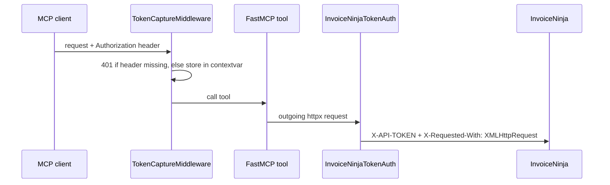
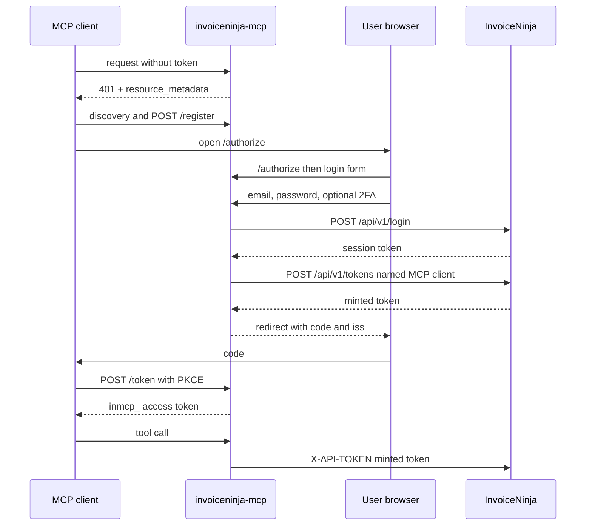

# How it works

The whole server is one module, `app/server.py`.

## Startup

`main()` picks the spec (see [Configuration](configuration.md#which-api-spec-is-used)), patches it in memory (`_patch_missing_request_bodies`, `_patch_design_schema`, `_patch_request_bodies` — no-ops where upstream is already correct), then `FastMCP.from_openapi` generates one tool per operation. If the spec can't be loaded, `build_error_server()` serves a lone `startup_error` tool.

## Token pass-through

1. `TokenCaptureMiddleware` (pure ASGI) requires `Authorization` on the MCP path and stashes it in a contextvar.
2. `InvoiceNinjaTokenAuth` (an `httpx.Auth`) reads it on the outgoing call, strips a leading `Bearer `, and sets `X-API-TOKEN`, plus the fixed `X-Requested-With` header InvoiceNinja's docs require.

## OAuth

In `oauth` and `both` modes the server is also an authorization server (the MCP SDK's `OAuthProvider`, subclassed as `InvoiceNinjaOAuthProvider`) with an encrypted file store under `/data/oauth`.

1. An unauthenticated request gets `401` with a `resource_metadata` pointer. The client discovers the endpoints and registers itself (Dynamic Client Registration).
2. `/authorize` hands the user to `/login`, where InvoiceNinja checks the credentials. The server mints a per-client token with the session token and never calls `/logout`.
3. The redirect carries the authorization code and `iss`. The client exchanges the code (PKCE) for an `inmcp_` access token and a refresh token.
4. On a tool call the server maps the access token to the minted InvoiceNinja token and sends it as `X-API-TOKEN`.

`resolve_auth_mode()` picks `token`, `oauth` or `both` from the environment, and `wrap_app()` assembles the ASGI stack for it. In both `oauth` and `both`, `IssuerFlagMiddleware` advertises `iss` support in the metadata and `UploadAuthMiddleware` gates the plain-HTTP `/upload/{entity}/{id}` route with the same bearer. Only in `both` does `BearerPrefixMiddleware` add `Bearer ` to raw tokens so FastMCP can parse them.
